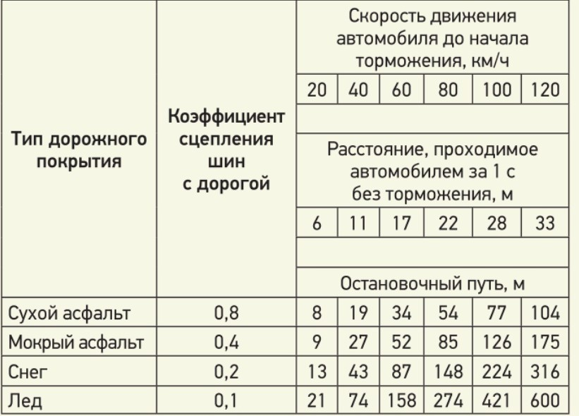

# БЕЗОПАСНОЕ ВОЖДЕНИЕ
## Глава 1. Виды безопасности
1. Активная безопасность - отсутствие ДТП.
1.1. Контроль дороги. (Обзор, предугадывание действий других водителей)
1.2. Контроль машины (анти-занос, нудная скорость, интервал, дистанция)
2. Пассивная безопасность - конструктивные особенности автомобиля, абс, есп
## Глава 2. Что такое безопасное вождение? 
"Безаварийно" не означает "безопасно". Может везти до поры до времени.  
Соблюдение ПДД не панацея. Важно, чтобы все участники движения его соблюдали, а не только ты. ПДД - это договорённость. А каждая договоренность подразумевает двустороннюю ответственность. Я нарушил ПДД — я виноват в ДТП, ты нарушил — ты виноват. Это ответственность юридическая. А еще есть ответственность личная, которая выражается в ответственном и внимательном подходе к вождению и готовности компенсировать ошибки других участников движения.

==Необходимо убеждаться в отсутствии помех и препятствий нужно ВСЕГДА, когда их появление на вашем пути ФИЗИЧЕСКИ ВОЗМОЖНО. И совсем не важно, возможно ли появление препятствия с точки зрения ПДД.==

==Безопасное управление автомобилем — это возможность в любое время совершить маневр, который позволит избежать ДТП.==

Есть возможность маневра — безопасно, нет возможности — опасно.

Возможность маневра у вас есть, если:
(1). Вы создаёте запас свободного места вокруг автомобиля;
(2). Вы создаёте запас тяги двигателя (способность быстро ускориться - выбор нужной передачи);
(3). Вы создаёте запас сцепления шин с дорогой;
(4). Вы готовы к возникновению экстремальной ситуации (физически и эмоционально). Ваша готовность к экстремальной ситуации: ответственность, собранность, бдительность — это и есть основа безопасного управления автомобилем.  
Далее, цифрой будут отмечены способы создания этих условий.

# ТЕХНИКА ВОЖДЕНИЯ
## Глава 3. Поговорим о технике вождения
В критической ситуации вы поступите так, как привыкли поступать. И хорошо, если это правильные привычки. Правильно — как было бы эффективно в экстремальной ситуации. 

==(4). Повторяемость действий, наличие шаблонов правильных действий. Любое повторяющееся действие за рулем (посадка, хват руля, руление, переключение передач и т. д.) выполняйте всегда правильно и одним и тем же способом. У вас должны быть выработаны стереотипы действий, и эти стереотипы должны быть правильными — эффективными в экстремальных ситуациях стереотипами, которыми пользуются профессиональные автогонщики.==

## Глава 4. Посадка водителя
==(4) Наиболее безопасно сидеть так, чтобы:==
- ==Хорошо чувствовать автомобиль;==
- ==Как можно меньше уставать;==
- ==Дольше сохранять внимание;==
- ==Быть готовым к действиям в экстремальных ситуациях.==

Положение рук на рулевом колесе.  
Есть два основных положения рук на руле: "10–2" (больше рычаг хвата, удобнее если нет усилителя руля) и "9–3" (лучше хват при повороте, лучше чувствительность машины, поворотники ближе). Их объединяет то, что оба хвата строго симметричные, закрытые.

Расстояние до руля и изгиб рук в локтях.  
Расстояние недолжно быть небольшим, но достаточным для того, чтобы вы, прижавшись лопатками к спинке сиденья, могли свободно положить руку "браслетом от часов" на верхнюю точку рулевого колеса. Рука при этом должна быть естественным образом немного согнута в локте. Руки были согнуты под углом 90–120°. Для ног же главное, чтобы они не были полностью выпрямленными при полном нажатии педалей.

Наклон спинки сиденья.  
Наклон в 10–20° от вертикали самый удобный и "работоспособный".

Полный контакт спины со спинкой сиденья.  
Это ключевой момент в управлении автомобилем. Есть такое понятие, как "чувство автомобиля". Оно берет свое начало как раз из хорошего контакта спины и сиденья. Ускорение при разгоне или повороте, момент начала заноса автомобиля — все это чувствуется спиной.

Высота подголовника.  
Должна быть такой, чтобы его середина находилась на уровне ваших глаз. При этом между затылком и подголовником должно быть небольшое расстояние — примерно с толщину ладони.

Ремень безопасности.  
Плечевой ремень не должен касаться лица или шеи и должен проходить через середину ключицы. Поясной ремень должен находиться на нижней части живота.

Положение руки на рычаге коробки передач.  
Рекомендую держать рычаг сверху закрытым хватом: ладонь обхватывает рычаг, большой палец замыкает хват сбоку - естественное положение руки.  
При включении передач рука либо тянет рычаг, либо толкает его. Включая II, IV или VI передачу, водитель тянет рычаг на себя пальцами, ладонь контролирует его положение. При включении I, III или V передачи, наоборот, ладонь включает передачу, а пальцы контролируют положение рычага. Рука так же, как и на руле, должна быть расслабленной, она лишь помогает рычагу "найти" нужное место.

Положение ног.  
Во время движения носок левой ноги в идеале находится левее педали сцепления. Пятка левой ноги должна быть расположена напротив педали сцепления так, чтобы при необходимости можно было, не отрывая ее от пола, в любой момент перенести носок на педаль и при этом не мешать правой ноге. Носок правой ноги располагается на педали газа. Пятка правой ноги должна находиться напротив педали тормоза так, чтобы можно было перемещать ногу с педали газа на педаль тормоза и обратно, не отрывая пятку от пола.

Зеркала заднего вида.  
В салонном зеркале должны быть видны: полностью заднее стекло, если есть возможность, часть правого заднего стекла; и вы не должны видеть свое лицо;  
В боковых зеркалах должны быть видны: дорога и ручка задней двери или заднее крыло вашего автомобиля.  
Линия горизонта должна проходить посередине зеркала.

## Глава 5. Техника руления
==(4) Оптимальное положение рук на руле — когда руки находятся на боковом секторе руля и "смотрят" в сторону поворота.==

Описывается поворот направо.

### Техника безотрывного руления
Без перехвата руля.  
Правая рука смещается на цифру 12 (при повороте на 90℃) или на 1 (при повороте на 120℃). Левая рука смещается на цифру 6 или 7.

### Техника руления с предварительным захватом
Если нужен поворот более чем на 120℃:
#### Вариант 1 - толкать снизу:  
Положение рук 9-3.  
Переместите левую руку в точку "6", скользя по ободу руля.  
Поверните руль левой рукой по часовой стрелке, одновременно ослабив хват правой руки и оставляя ее на месте.  
Когда левая рука достигнет точки "9", захватите руль правой рукой. Продолжите вращение далее (двумя руками), если это необходимо, но не уводите правую руку далее точки 7.  

#### Вариант 2 - тянуть сверху:
Положение рук - "9-3".  
Переместите правую руку в точку "10", скользя по ободу руля.  
Поверните руль правой рукой по часовой стрелке, одновременно ослабив хват левой руки и оставляя ее на месте.  
Когда правая рука достигнет точки "3" захватите руль левой рукой и продолжите вращение далее двумя руками.  
Этот способ позволяет более крутой угол поворота.

### Техника руления с перехватом
Положение рук — "9–3".  
Поверните руль вправо двумя руками до положения "10–4".  
Когда правая рука достигнет положения "4", снимите её и начните перемещать ее в направлении точки "11".  
Продолжайте вращать руль левой рукой до положения "4", одновременно захватив руль правой рукой в точке "11".  
Когда левая рука достигнет положения "4", снимите ее с руля и направьте вверх.  
Продолжите вращение руля правой рукой.  
Зафиксируйте руль правой рукой в нужном положении и одновременно захватите его в верхнем секторе левой рукой.  
На выходе из поворота верните руль в исходное положение в обратном порядке.

## Глава 6. Парковка и маневрирование в ограниченном пространстве 
==(4) Чем ниже скорость движения, которую вы поддерживаете, тем точнее вы можете маневрировать.==

Если экономите место, вращайте руль на месте. Если экономите время, вращайте руль на ходу.

Автомобиль при движении задом становится более маневренным поэтому не задерживайте надолго руль в повернутом положении. Правильнее несколько раз коротко повернуть руль и вернуть его в положение "прямо".  
Используется в большинстве приемов парковки.

### Движение задним ходом
Контроль существляется через зеркала заднего вида, находясь в кресле в обычном положении; и через задние стекла автомобиля, располагаясь в кресле вполоборота.  
Движение вполоборота дает вам возможность двигаться задним ходом более уверенно и быстро, чем с помощью зеркал заднего вида, хотя и с меньшей точностью из-за ограниченной обзорности.  
Движение по зеркалам, наоборот, менее скоростное, но зато позволяет маневрировать с большей точностью.

### Статические габариты автомобиля
Это центры бамперов спереди и сзади, а также зеркала сбоку.

### Динамические габариты автомобиля 
При движении в ограниченном пространстве по дуге малого радиуса автомобилю требуется больше места, чем при движении по прямой. Он как бы становится шире. Контролируйте внешний угол переднего бампера и внутреннее заднее колесо автомобиля.

**При выезде из узкого проезда передним ходом** или при необходимости объехать препятствие поворачивать руль можно после того, как мимо препятствия пройдет внутреннее заднее колесо вашей машины - оно находится под спинкой заднего сиденья или под задней стойкой кузова автомобиля.  
Если же расстояние до препятствия не менее 0,5 метра, ориентир по средней стойке кузова или по спинке переднего сиденья.  
При расстоянии более 1 метра или больше расстояния открытой двери, руль можно поворачивать до упора без риска столкновения уже тогда, когда с краем препятствия поравняется боковое зеркало.

**При выезде из узкого проезда задним ходом** поворот руля можно начинать после того, как через створ проезда пройдет передний бампер.

**Безопасный боковой интервал** при маневрировании задним ходом - около 1 метра, при наличии которого между машиной и препятствием можно поворачивать руль в любой момент без риска столкновения. Безопасный интервал можно оценить как расстояние открытой двери.

**Безопасная дистанция** при маневрировании передним ходом - если вы видите задние колеса стоящего впереди автомобиля, значит, места хватит. 

### Параллельная парковка
Если расстояние между двумя стоящими друг за другом автомобилями превышает двойную длину вашего автомобиля, можно въезжать между ними передним ходом.

### Парковка задним ходом
1. Двигаясь вдоль дороги передним ходом, остановите автомобиль рядом со стоящим автомобилем, за которым вы хотите припарковаться, так, чтобы задние бамперы вашего и припаркованного автомобилей были примерно на одной линии. Боковой интервал между вашим и стоящим автомобилями может быть от 1 до 0,3 метра.
2. Поверните руль в крайнее правое положение.
3. Включите заднюю передачу и начните медленное движение задним ходом, удерживая руль в повернутом положении.
4. Когда ваш автомобиль займет положение под углом примерно 40° к направлению дороги, остановите автомобиль и верните руль в положение "прямо". Чем длиннее ваш автомобиль, тем меньше должен быть угол между машиной и дорогой. Определить этот угол вам помогут два ориентира: 
- правая средняя стойка (или спинка переднего сиденья) вашего автомобиля находится напротив левого заднего угла стоящего впереди автомобиля;
- в левое зеркало заднего вида вы можете целиком видеть бампер стоящего сзади автомобиля.
5. Продолжите движение задним ходом, удерживая руль в положении "прямо", пока передний правый угол вашего автомобиля не поравняется с левым задним углом стоящего впереди автомобиля. Кроме того, вы можете ориентироваться по боковому зеркалу: если до бордюра еще далеко, нужно проехать по прямой, пока расстояние между задним колесом и бордюром не станет менее 1 метра.
6. Когда передний правый угол вашего автомобиля поравняется с левым задним углом стоящего впереди автомобиля, либо когда от заднего колеса до бордюра останется менее метра, остановите автомобиль и поверните руль до упора влево.
7. Продолжайте движение задним ходом, удерживая руль в повернутом положении до того момента, когда ваш автомобиль не расположится параллельно дороге.
8. Если нужно, верните руль в положение "прямо" и займите положение посередине между стоящими автомобилями. 

### Перпендикулярная парковка передним ходом
#### Вариант 1  
1. Двигайтесь передним ходом вдоль стоящих перпендикулярно дороге автомобилей с максимально возможным интервалом до них (не менее ширины легковой машины).
2. Когда переднее зеркало вашей машины поравняется с дальним бортом автомобиля, за которым вы хотите припарковаться, поверните руль до упора вправо.
3. Въезжайте на место парковки, выравнивая колеса так, чтобы расположиться посередине между стоящими автомобилями. Если при этом вы упираетесь в стоящий слева автомобиль, то заезд нужно выполнять в несколько приемов.

#### Вариант 2  
1. Двигайтесь передним ходом вдоль стоящих перпендикулярно дороге автомобилей с интервалом не менее расстояния открытой двери (примерно 1 метр).
2. Когда задний бампер вашего автомобиля поравняется с ближним бортом автомобиля, перед которым вы хотите припарковаться, остановите машину.
3. Поверните руль в крайнее левое положение.
4. Включите заднюю передачу и начните движение задним ходом, удерживая руль в повернутом положении.
5. Как только ваш автомобиль займет перпендикулярное дороге положение, верните руль в положение "прямо" и остановите машину. Если вы все сделали правильно, то после остановки автомобиль будет находиться напротив свободного места между стоящими автомобилями.
6. Включите первую передачу и въезжайте на место парковки так, чтобы расположить машину посередине между стоящими автомобилями.

### Перпендикулярная парковка задним ходом
#### Вариант 1
1. Двигайтесь передним ходом вдоль стоящих перпендикулярно дороге автомобилей с минимально возможным интервалом до них.
2. Когда боковое зеркало вашего автомобиля поравняется с дальним бортом  автомобиля, за которым вы хотите парковаться, поверните руль до упора влево.
3. Продолжайте движение вперед, удерживая руль в повернутом положении.
4. Как только машина займет перпендикулярное дороге положение (в этот момент в зеркала заднего вида вы должны увидеть свободное место между автомобилями), верните руль в положение "прямо", остановите автомобиль и включите заднюю передачу. Если вы все сделали правильно, то после остановки автомобиль будет находиться напротив свободного места между стоящими машинами.
5. Двигаясь задним ходом, въезжайте на место парковки так, чтобы расположить свой автомобиль посередине между стоящими автомобилями.

#### Вариант 2
1. Двигайтесь передним ходом вдоль стоящих перпендикулярно дороге автомобилей с интервалом, примерно равным ширине легковой машины до них (1,5–2,0 метра). Если места слишком мало и интервал между вашим и стоящими автомобилями менее 1 метра, скорее всего, парковка в один прием невозможна и следует парковаться в несколько приемов
2. Когда задний бампер вашего автомобиля поравняется с дальним бортом стоящего автомобиля, перед которым вы хотите припарковаться, остановите машину.
3. Поверните руль в крайнее правое положение.
4. Включите заднюю передачу и начните движение задним ходом, удерживая руль в повернутом положении.
5. Контролируйте с помощью правого зеркала заднего вида боковой интервал между вашей машиной и углом бампера припаркованного автомобиля, чтобы он не уменьшился до критически малого. Если интервал между машинами не уменьшится до опасно малого, то автомобиль беспрепятственно займет парковочное место в один прием.
6. Въезжайте на место парковки, выравнивая колеса так, чтобы расположиться посередине между стоящими автомобилями.

Чтобы припарковаться за один приём, следует встать заполним бампером перпендикулярно первому стоящему автомобилю. Если не доехать/ переехать слишком далеко вы утереть в одну из машин - справа или слева. Исправить  это помогут два манёвра - 
##### Случай 1
Вы начали парковаться и в боковом зеркале увидели, что зазор между правым боком вашего автомобиля и левым передним углом стоящего автомобиля уменьшился до 10–20 см. В этом случае сделайте следующее:
1. Остановите машину и поставьте руль в положение "прямо".
2. Продолжайте прямолинейное движение задним ходом.
3. Когда правая задняя стойка (или спинка заднего дивана) вашего автомобиля поравняется с левым передним углом бампера стоящего автомобиля, снова поверните руль в крайнее правое положение.
4. Въезжайте на место парковки, выравнивая колеса так, чтобы расположиться посередине между стоящими автомобилями. 

##### Случай 2
Вы начали парковаться и поняли, что упираетесь в дальний по ходу движения автомобиль. Тогда заезжайте в несколько приемов:
1. Остановите машину. Поверните руль до упора влево.
2. Включите первую передачу и сдайте немного вперед, пока не увидите в боковых зеркалах достаточный для заезда боковой интервал между машинами.
3. Остановите машину. Поверните руль прямо. Включите заднюю передачу. Заезжайте на место парковки, при необходимости корректируя траекторию движения рулем.

# Глава 7. Работа двигателя
## Параметры двигателя
Крутящий момент отвечает за динамику разгона машины, ее "приемистость". Измеряется он в ньютон-метрах (Н.м.). Чем больший крутящий момент развивает мотор, тем быстрее ускоряется машина.  
Мощность обычно измеряется в лошадиных силах (л.с.) и, соответственно, отвечает за скорость.

==(2) Двигаясь в режиме максимального крутящего момента, вы можете сделать опасные ситуации безопасными.==

# Глава 8. Переключение передач 
## Переключение передач на "механике"
Переключать следует руководствуясь показаниями тахометра.

Причины, по которым машина может дергаться во время переключения передачи:
1. **Несвоевременное выключение передачи и нажатие педали сцепления.**  
Передачу нужно "вытыкать" в конкретный момент — в момент отпускания педали газа или позднее. Сильно "опаздывать" нежелательно, поскольку это увеличит время переключения и приведет к рывку, раньше — до отпускания педали газа — тоже будет рывок.  
Секрет плавного выключения передачи состоит в том, чтобы выжать педаль сцепления и перевести рычаг из включенной передачи в нейтраль одновременно, синхронно с отпусканием педали газа.
2. **Долгий переход от низшей передачи к высшей.**  
Задержка рычага в нейтральном положении при переключении сохраняет жизнь коробке передач. Нарушение этого правила — мгновенный переход с одной передачи в другую — не дает какого-либо выигрыша во времени переключения.  
Вы включаете и выключаете передачу не рычагом, а педалью сцепления. Пока сцепление нажато, передача не включена. А чтобы выключить передачу — нужно только нажать сцепление.  
Время падения стрелки тахометра при переключении и есть оптимальное время для переключения передачи.  
Отпускать педаль сцепления можно в два этапа. Или в один - вы должны перемещать левую ногу вверх максимально быстро, но так, чтобы она не отрывалась от педали. 
3. **Резкое нажатие на педаль газа после включения повышенной передачи.**  
Нажимайте на педаль газа плавно и постепенно. Можно выжать ее до пола, но на это у вас должно уходить не 0,1 секунды, а в районе 2 секунд.
4. **Несинхронная работа педалями сцепления и газа.**  
Рычаг переключения передач нужно переключать раньше чем отпускать сцепление. Но это быстрее, чем отпускать педаль. Поэтому действовать нужно одновременно.

Ключевые моменты переключения передач вверх:
- Выбирайте момент переключения по тахометру. Разгоняйтесь до 3000–3500 об/мин на каждой передаче в штатном, спокойном режиме разгона.  Разгоняйтесь до красной зоны (6000–7000 об/мин) на каждой передаче в случае необходимости экстренного ускорения.
- Выключайте передачу одновременно (можно позже, но не раньше!) с отпусканием педали газа.
- Действуйте рычагом и педалями с минимальной задержкой, идеально — синхронно.
- Задерживайте рычаг коробки передач в нейтральном положении.
- Отпускайте педаль сцепления одномоментно, но в то же время плавно, сопровождая ее обратный ход ногой.
- Оптимальное время переключения передачи — время падения стрелки тахометра.
- Нажимайте на педаль газа плавно и постепенно. Время нажатия ее до пола — не менее 1 секунды.
- Работайте педалями газа и сцепления синхронно: нажали сцепление — отпустили газ, и наоборот.

Алгоритм переключения передач вверх:
1. Разгонитесь на I передаче до нужного вам момента включения II передачи. Для этого постепенно "утапливайте" педаль газа так, чтобы за 2–3 секунды переместить ее на 50–90% хода педали.
2. Перенесите носок левой ноги с упора на педаль сцепления. Одновременно с этим перенесите правую руку с рулевого колеса на рычаг КП.
3. Выжмите педаль сцепления, одновременно отпустите педаль газа и одновременно же включите нейтральную (N) передачу.
4. Задержите рычаг КП в нейтральном положении на 0,3– 0,5 секунды.
5. Переведите рычаг в положение II передачи. Одновременно с этим начните плавно отпускать педаль сцепления и добавлять газ.

### Как избежать рывка при понижении передач:
#### Способ 1
Плавное отпускание сцепления. Самый простой, но не самый эффективный способ сглаживания рывка при понижении передачи — дольше отпускать педаль сцепления. Как долго? Секунды 2-3, пока двигатель плавно не наберет обороты.  
#### Способ 2 - "перегазовка"
Суть в том, что водитель до начала переключения передачи повышает обороты двигателя. Мотору становится не нужно раскручиваться, он уже раскрученный и поэтому "мягко принимает" пониженную передачу. Вот последовательность действий на примере перехода с III на II передачу:
1. Разгонитесь до 50 км/ч на III передаче. Тахометр покажет примерно 2500 об/мин.
2. Отпустите педаль газа, одновременно выжмите педаль сцепления и одновременно переведите рычаг коробки передач в нейтральное положение.
3. Отпустите педаль сцепления, и одновременно на короткое время нажмите на педаль газа так, чтобы стрелка тахометра поднялась примерно до 4000 об/мин.
4. Снова выжмите педаль сцепления.
5. Переведите рычаг во II передачу, одновременно начиная отпускать педаль сцепления и, если нужно, плавно добавляя газ.

Вы делаете перегазовку при включенной нейтральной передаче, тем самым раскручиваете не только мотор, но и саму коробку. И продлеваете ее жизнь, как и жизнь сцепления.  
Если же сцепление не отпускать, то перегазовкой вы раскрутите только двигатель, валы же коробки передач будут "жить" своей жизнью и при включении передачи будут каждый раз испытывать небольшой, но рывочек. Жалеть коробку или нет — решать вам.

## Переключение передач вверх на АКПП
На всех типах АКП повышенная передача включается автоматически при переходе к равномерному движению и фиксации педали газа в одном положении. Поэтому если при старте с места вы нажмете педаль газа и во время всего разгона будете удерживать ее в каком-то одном, среднем положении, то автомобиль получит среднее по интенсивности ускорение.

Для того чтобы осуществить активный разгон на автомобиле с АКП, сделайте следующее:
1. Для старта с места отпустите педаль тормоза и слегка нажмите на педаль газа.
2. После старта продолжайте плавно увеличивать давление на газ и контролировать показания тахометра. В режиме нарастающего усилия на педаль газа автомобиль будет ускоряться без переключения передачи до тех пор, пока вы не ослабите нажатие на нее (приотпустите или отпустите полностью). Для штатного экономичного разгона педаль можно нажимать почти до конца, но не допуская включения режима kick-down. Если вы уже достигли нижнего положения педали, и вам необходимо разгоняться далее без перехода на повышенную передачу, то задержите педаль в этом положении и продолжайте разгон.
3. По достижении стрелкой тахометра нужных вам оборотов для переключения передачи (например, 3500 об/мин), ослабьте нажатие педали газа. Автомобиль перейдет на повышенную передачу, и тахометр несколько понизит показания.
4. Для продолжения разгона снова надавите на педаль газаи далее повторяйте цикл действий, описанный в п. 2-3.

## Переключение передач вниз на АКПП
### Автоматическое переключение
Практически любая АКП автоматически перейдет на одну или несколько передач вниз, если на данной передаче двигателю не хватает тяги для поддержания или изменения скорости. Кроме того, вы можете сознательно спровоцировать включение пониженной передачи с помощью режима kick-down ("кикдаун"). Это режим принудительного включения пониженной передачи, который включится, если вы нажмете на педаль газа "в пол" (отсюда название kick-down). На многих автомобилях включение "кикдауна" можно легко контролировать ногой — в нижнем положении педали установлена кнопка его включения, для нажатия которой необходимо приложить дополнительное усилие, так что педаль до пола нажимается как бы в два этапа.

### Ручное переключение
Рывок при понижении передачи возникает из-за того, что вращения деталей двигателя, коробки передач и колес автомобиля не соответствуют друг другу. Их можно синхронизировать и до включения пониженной передачи с помощью все той же перегазовки – короткого нажатия на педаль газа, как и на автомобилях с МКП:
1. Выберите такую скорость движения на повышенной передаче, при которой стрелка тахометра покажет 2000-3000 об/мин. При таких оборотах проще делать перегазовку, хотя это возможно и при более высоких оборотах.
2. Переведите селектор передач один раз в сторону положения "–". Это послужит командой АКП для перехода на пониженную передачу. Переключение происходит не мгновенно, а с некоторой задержкой.
3. Во время этой задержки коротко нажмите на педаль газа. Если вы все сделали вовремя, то пониженная передача включится незаметно для вас, без рывка.

# Глава 9. Прямолинейное движение автомобиля 
Торможение сопровождается перераспределением веса автомобиля с задней оси на переднюю. Из этого следует, что сцепление передних шин с дорогой улучшается, а задних, наоборот, ухудшается. Для задних шин это означает риск заскользить, а для автомобиля в целом — попасть в занос.  
Отпускание педали газа — тоже торможение, только двигателем. 

==(3) Что делать, чтобы не возникал занос в повороте? Как минимум не отпускать педаль газа, а как максимум — не тормозить.==

==(3) Максимальное сцепление шин с дорогой сохраняется при равномерном распределении веса между всеми шинами. Чем меньше перераспределение веса, чем плавнее действия водителя, тем лучше сцепление с дорогой и безопаснее движение.==

Возможно даже интенсивные торможения делать плавными.

==(3) Педаль тормоза нужно нажимать прогрессивно — постепенно увеличивая силу нажатия.==

В конце торможения, перед остановкой автомобиля, нужно плавно убрать ногу с педали тормоза во избежание клевка автомобиля. 

На педаль нужно нажимать один раз.

## Виды торможения  
### Торможение накатом  - при включённой нейтрали
Этот способ торможения был актуален в прошлом веке вследствие несовершенства двигателей и их непригодности к долгой работе на высоких оборотах — они перегревались.

Следующие способы подразумевают переключение передач вниз, которое возможно как с использованием перегазовки, так и без нее. 

Комбинированное торможение на постоянной передаче

Торможение двигателем с понижением передач и перегазовкой 

- отпускаем педаль газа;
- замедляемся; • при снижении стрелки тахометра до 2500 об/мин понижаем передачи с перегазовкой; • после включения II передачи замедляемся на ней и для полной остановки нажимаем на педаль тормоза; • если тормозим на льду или если после торможения нужно продолжать движение со скоростью менее 10 км/ч, можно переключаться и до I передачи. Напоминаю, что педаль сцепления выжимаем только после достижения стрелкой тахометра отметки 1000 об/мин.

Комбинированное торможение с понижением передач и перегазовкой  
выполняется аналогично торможению двигателем, только к нему добавляется нажатие на педаль тормоза. Наиболее часто используемый вариант торможения в городе.
- нажимаем на педаль тормоза; • при снижении стрелки тахометра до отметки 2500 об/мин снимаем ногу с педали тормоза и делаем перегазовку; • включаем пониженную передачу и возвращаем ногу на тормоз; • продолжаем описанный цикл действий до включения II передачи и тормозим на ней до остановки.

Комбинированное торможение с понижением передач и перегазовкой пяткой  
Классический гоночный вариант: тормозим носком ноги, а перегазовку делаем пяткой. Или тормозим левой часть стопы, перегазовка - правой. Одновременно.

экстренный разгон
==нужно ускоряться так, чтобы стрелка тахометра при переключении передач достигала максимальных оборотов — красной зоны.      (2), (4) ==

==На автомобиле с механической коробкой передач или с автоматической коробкой в ручном режиме нужно переключать передачу во время разгона, лишь когда стрелка тахометра достигнет красной зоны.       (2), (4)==

Экстренное торможение 
Чтобы реализовать максимальное возможное замедление, нужно тормозить так, чтобы шины катились на грани скольжения, на грани блокировки колес тормозами.  
Это обеспечивает АБС. Такое, основное преимущество автомобиля с АБС — возможность изменять направление движения рулем во время экстренного торможения.  
надо выжимать педаль сцепления, во избежания остановки двигателя.

АБС имитирует действия водителя при импульсном торможении.  
Суть приема в том, что после начала блокировки колес вы сразу ослабляете нажим на тормозную педаль, чтобы колеса снова начали вращаться. После чего повторяете описанный цикл действий. В результате чего торможение выглядит как импульсное. Прием тем эффективнее, чем чаще водитель нажимает на педаль тормоза. Рекомендуется делать 3–4 нажатия в секунду.
Но это противоестественно.
Поэтому моя рекомендация — тормозите на машине без АБС так же, как с АБС: тормоз "в пол"!
- Это соответствует психологии человека!
- Невозможно рулить, но ничего не поделаешь, зато тормозной путь по прямой всегда короче, чем с маневрированием при работающей АБС.
- Машину может занести и закрутить по дороге, но это не страшно, ведь при торможении "юзом" с четырьмя заблокированными колесами машина движется точно по прямой. В смысле, она может как угодно крутиться и вертеться вокруг своей оси, но на прямой, ровной и горизонтальной дороге все это будет происходить вдоль прямой линии.
- еще один нюанс — если машина скользит по дороге, то тормозной путь при вращении всегда короче, чем по прямой.

Прерывистое торможение можно использовать не как экстренное, а штатное, в качестве превентивной  меры.

при торможении очень важно сохранять расслабленность рук и быть готовым к маневру.

==тормозной путь минимален, когда руль "смотрит прямо", и увеличивается по мере отклонения руля в сторону.                        (3)==
Верно и обратное: во время торможения машина поворачивает гораздо менее охотно.

Остановка в заданном месте при экстренном торможении 
==Намного проще спрогнозировать появление препятствия на пути, чем спрогнозировать тормозной путь до этого препятствия.           (4)==

То есть тормозной путь при экстренном торможении зависит от скорости и коэффициента сцепления шин с дорогой.  
Не стоит экономить на шинах. ность, внимательность и предусмотрительность. Намного проще спрогнозировать появление Качественные шины зарекомендовавших себя производителей — залог безопасной езды. летом — летние шины, зимой — зимние.

В жизни более важен остановочный путь — это тормозной путь плюс путь, пройденный за время реакции водителя.

==Управляйте автомобилем так, как будто у вас нет возможности для экстренного торможения. (4)==

Установившееся движение 

==идеальный режим движения — это движение с постоянной скоростью.         (3)==

==если вы внезапно выехали на скользкий участок дороги (например, участок асфальта сменил участок, покрытый льдом), продолжайте движение с той же постоянной скоростью.         (3)== - торможение, к тому-же резкое может испортить ситуацию.

# Глава 10. Прохождение поворотов
## Фазы поворота
Поворот принято подразделять на фазы:
I — подход к повороту — движение по прямой (зона 1–2);
II — вход в поворот — поворот руля (точка 2);
III — движение по дуге (зона 2–3);
IV — выход из поворота — возврат руля, спрямление траектории (зона 3–4).  
Точка касания автомобилем внутренней части поворота называется "апекс".  

## Алгоритм прохождения поворота
- Торможение:
   - снижение скорости на прямой;
   - снижение скорости до безопасного значения.
- Передача:
   - пониженная, соответствующая показаниям тахометра в пределах 3000–3500 об/мин;
   - включение передачи до поворота.
- Взгляд:
   - в точку на дороге, куда вы хотите привести машину;
   - в точку на дороге на несколько секунд вперед. 
- Управление:
   - однократный поворот руля на необходимый угол, без подруливаний и доворотов;
   - на минимально возможный угол.
- Траектория (следствие руления):
   - постоянного или увеличивающегося радиуса;
   - с использованием всей ширины полосы движения.
- Педаль газа:
   - должна быть слегка нажата на дуге для поддержания постоянной скорости;
   - может быть нажата для ускорения одновременно с возвратом руля в положение "прямо".

## Действия для прохождения поворота:
### Торможение.  
==машина может делать хорошо что-либо одно: либо поворачивать, либо тормозить (ускоряться). (3)==  
Отсюда следует, что на дуге лучше совсем не тормозить, так как торможение при прохождении поворота — самый верный способ отправить машину в скольжение. Тормозить правильно до начала поворота, пока машина движется по прямой.  
==безопасную скорость на дуге поворота можно охарактеризовать как скорость, при которой нет желания притормозить и нет дискомфорта при движении со слегка нажатой педалью газа. (3), (4)==
### Переключение передач  
лучше всего включать нужную передачу до входа в поворот. Переключаться на повышенную передачу следует уже после выхода из поворота во время разгона на прямой.  
если в повороте машина сорвется в скольжение, то одной из возможностей спасти машину будет включенная пониженная передача и как следствие — повышенные обороты мотора.
### Траектория поворота  
траектория не должна быть ломаной и становиться круче по мере движения по дуге.  
Правильных вариантов прохождения поворота два:
- Траектория с постоянным радиусом. Повернули руль один раз на входе, проехали дугу и вернули руль в прямолинейное положение на выходе.
- Траектория, которая на входе круче, чем на выходе. На входе поворачивает руль, а затем уже в середине поворота начинает плавно возвращать его в положение прямолинейного движения.  
В повороте в плотном потоке на многополосной дороге разумно выбирать траекторию, ориентируясь на других участников движения и соблюдая безопасные дистанцию и интервал. Также следует учитывать тип дорожного покрытия - не выбирать сколькие участки дороги, пусть траектория и будет неидеальной.
### Взгляд
==нужно смотреть туда, куда вы планируете привести машину. И чем дальше вы смотрите, чем точнее будет "прицел". В повороте идеально смотреть на ту точку дороги, где машина окажется через несколько секунд. (4)==  
И смотреть надо не туда, куда машина едет сейчас (то есть вперед), а туда, где она должна оказаться (то есть в сторону).
### Работа двигателя
При движении по дуге поворота у вас всегда должна быть слегка нажата педаль газа для поддержания постоянной скорости.Наибольшей устойчивостью на дуге поворота автомобиль обладает при движении с ровно нажатой педалью газа и постоянной скоростью. Почему? Потому что, если шины заскользят по дороге и машину "понесет", первое, что нужно сделать, — отпустить педаль газа и тем самым использовать двигатель для стабилизации машины.  
==В повороте безопаснее всего двигаться в режиме максимального крутящего момента двигателя, то есть на пониженной передаче.         (2)==

# Глава 11. Скольжение автомобиля
## Снос автомобиля
Снос — потеря управляемости автомобиля: его движение наружу поворота, вызванное скольжением передних шин(более пологое, чем требовалось);

Причины:
- чрезмерный поворот руля в повороте;
- резкий поворот руля;
- торможение при повернутом руле;
- чрезмерное нажатие на газ (передний и полный приводы).
==Если вы переборщили со скоростью в повороте и вызвали снос, плавно замедлитесь — отпустите педаль газа. (3)==
## Занос автомобиля
Занос — потеря устойчивости автомобиля: явление, когда из-за скольжения задних шин по дороге задняя часть автомобиля начинает обгонять переднюю - движение боком, дрифт.  
причины заноса:
- превышение скорости входа в поворот;
- сброс газа или торможение в повороте;
- задержка возврата руля в положение "прямо" при смене направления поворота;
- торможение "юзом" (на автомобилях без АБС);
- "передозировка газа" (задний привод).
Выход из заноса - Передние колеса всегда должны "смотреть" в направлении дороги, а значит, во время заноса рулите туда, куда хотите направить машину.

# техника вождения итоги
**Учитесь правильно сидеть за рулем и старайтесь так ездить всегда:**
- ставьте спинку сиденья почти вертикально;
- расстояние рук до руля важнее, чем ног до педалей;
- сидите к рулю достаточно, но не слишком близко — "браслет часов" должен свободно лежать на точке "12" руля;
- правильно регулируйте зеркала заднего вида;
- пристегивайтесь ремнем безопасности и пристегивайте всех пассажиров;
- ездите без верхней одежды;
- переобувайтесь в удобную для вождения обувь.
- 
- Привыкайте правильно и всегда одинаково работать с органами управления: • держите руль двумя руками в точках "9–3", большие пальцы — внутри обода руля; • вращайте руль двумя руками; • используйте четыре варианта руления для прохождения поворотов; • после поворота вращайте руль обратно, не давая ему самопроизвольно выравниваться.
- 
- Рационально используйте возможности двигателя: • высокие обороты двигателя — хорошо, а низкие — плохо; • при разгоне используйте два диапазона оборотов: экономичный и скоростной; • в штатных ситуациях ездите в экономичном режиме, в опасных — в скоростном режиме.
- 
- Правильно управляйте автомобилем на прямой: • начало движения на холостых оборотах без нажатия на газ — универсальный способ трогаться с места на льду, асфальте, подъеме; • при разгоне переключайте передачи вверх, а при замедлении — вниз; • переключайте передачи мягко, плавно, без рывков автомобиля, чтобы пассажиры не замечали переключений; • нажимайте на педаль тормоза и отпускайте ее деликатно — без "клевков" автомобиля.
- 
- Правильно управляйте автомобилем в повороте: • снижайте скорость до поворота, в повороте свободно катитесь с постоянной скоростью на постоянном газе; • если нужно понизить передачу, делайте это до поворота; • перед входом на дугу однократно поверните руль на нужный угол; • двигайтесь по дуге в режиме максимального крутящего момента двигателя; • на дуге не тормозите, не разгоняйтесь, не подруливайте; • пройдя дугу, плавно возвращайте руль в положение "прямо" и, если нужно, одновременно разгоняйтесь. 
- 
- Правильно действуйте в случае скольжения автомобиля: • если в повороте начался снос — не вращайте руль и отпустите педаль газа; • если начался занос — отпустите педаль газа и вращайте руль в сторону желаемого направления движения , после чего быстро верните руль в положение "прямо".
# ТАКТИКА ВОЖДЕНИЯ
## Глава 12. Готовность водителя к экстремальной ситуации
Компенсировать ошибки других участников движения — базовый принцип современного безопасного вождения.
### Цветовой код Купера
**Белый цвет** — полный "релакс", или отсутствие бдительности. Это состояние идеальной жертвы. Описать его можно как уход в собственные мысли.  
**Желтый цвет** — это уверенное спокойствие профессионала, расслабленного и внимательного одновременно. отличается от белого переносом фокуса внимания из внутреннего мира во внешний. "Желтое" состояние означает контроль ситуации. ны, все хорошо и спокойно, завтра сделаю предложение любимой девушке…" С точки зрения вождения к белому состоянию можно отнести не только романтический настрой, но и любые мысли или действия водителя, не име"желтое" состояние водителя — состояние наблюдения за внешним миром, постоянный анализ поступающей информации, прогнозирование изменений дорожной обстановки и соответствующая корректировка своего движения.  
**Оранжевый цвет** — боеготовность № 1! за рулем применяем приемы экстренного маневрирования.  
**Красный цвет** — ДТП состоялось.

==приоритет не дает права проехать первым, он дает вам право рассмотреть такую возможность.  (4)==  
==Если вашим приоритетом пренебрегли — уступите дорогу.              (4)==  
==На одной дороге — значит, в одной команде. Водители в транспортном потоке не соперники, а партнеры.                    (4)==  
постоянно наблюдайте за ближайшими "соседями" по дороге, старайтесь понять их намерения, учитывайте их и в соответствии с этим корректируйте свое движение. Если кто-то ошибся и создал вам помеху, меняйте скорость, дистанцию, интервал так, чтобы скомпенсировать ошибку. Если же вы видите, что мешаете другому водителю, следует не ждать от него компенсирующего действия, а исправить свою ошибку самостоятельно.
## Глава 13. Эффективное вождение
### Равномерность движения
чем ближе текущая скорость движения автомобиля к его средней скорости в пути, тем равномернее и рациональнее движение.  
чтобы двигаться равномерно, ограничивайте максимальную скорость так, чтобы уменьшить количество и величину перепадов скоростей в пути.  
Критерий правильно выбранной скорости движения – отсутствие  незапланированных торможений.
### Экономичное вождение
На расход топлива влияют следующие условия эксплуатации автомобиля:
- выбор режима работы двигателя;
- выбор передач КП;
- режимы движения — установившееся движение, ускорение, торможение;
- выбор скорости движения
#### Режим работы двигателя
Меньше всего топлива расходуется при движении в экономичном диапазоне оборотов коленчатого вала двигателя, когда стрелка тахометра показывает 2000–3500 об/мин на бензиновых моторах и 1500–2500 на дизельных.  
движение экономичнее, когда большую часть пути автомобиль проходит с постоянной скоростью.
##### Режим ускорения
Чем быстрее вы ускорите машину до нужной скорости и перейдете к движению с постоянной скоростью, тем больше сэкономите топлива.
##### Режим замедления
Максимально экономичный способ торможения — раннее торможение с максимально плавным замедлением и максимальным тормозным путем.
##### Выбор скорости движения
Чем выше скорость движения, тем выше расход топлива. При 110км/ч и выше - расход более значителен.

большой объем двигателя тоже позволяет ездить экономично, но чем больше объем двигателя, тем в большей степени расход топлива зависит от манеры вождения.

==Оптимальное управление автомобилем заключается в нахождении разумного компромисса между экономичностью и динамичностью.  (2), (4)==

## Глава 14. ДВИЖЕНИЕ В ТРАНСПОРТНОМ ПОТОКЕ
### Выезд на главную дорогу и перестроение
==В момент пересечения границы соседнего ряда ваша скорость должна быть больше или равна  — не меньше — скорости движения автомобиля в этом ряду (1)==.  
перестраиваться нужно с ускорением и нажатой педалью газа!  
==при выезде на главную дорогу оценивайте не только расстояние, но и скорость приближающегося автомобиля. Именно от его скорости зависит ваша безопасность.    (1)==  
==Перестраиваться можно, если автомобиль, перед которым собираетесь перестроиться, вы видите в боковое зеркало (в городе) или салонное зеркало заднего вида (на трассе) (1)==   

==Перестроение можно считать полностью безопасным, если вы на 100% уверены в отсутствии машины сбоку. Это вы можете гарантировать, только если проконтролируете "мертвую зону" поворотом головы в сторону будущего перестроения (4)==  
==При перестроении контролируйте автомобили в третьих рядах (4)==  
==Если задача новичка — избежать столкновения в принципе, то задача продвинутого водителя — избежать нарушения границ безопасного пространства своей машины и "зарубить" процесс сближения на начальном этапе.  (1), (4)==, то есть заметить начавшееся сближение машин заранее и своевременно отреагировать на него изменением скорости или направления движения.
### Прогнозирование
==чтобы заметить опасность заранее, нужно смотреть далеко вперед.         (4)==  
Вспомните жёлтое состояние. Выйдите наружу из своей "скорлупы" и сфокусируйтесь на внешнем мире. Далее, ваша задача — определить наиболее опасный в данный момент автомобиль - готовый перестроится, или затормозить. Если вы видите обстановку в целом, вы успеете безопасно и предсказуемо среагировать на изменение ситуации.  
==если вы за рулем находите время и возможность  заниматься чем-то еще, кроме вождения, значит, вы чего-то не замечаете.              (4)==  
==если есть чем заняться, значит, плохо следите за дорогой и машиной. Если же вы не можете отвлечься от дороги или, отвлекаясь, чувствуете, что теряете контроль, значит, есть шанс, что вы все видите и обрабатываете всю поступаемую информацию.    (4)==  
Основной метод обеспечения безопасности — постоянное ведение наблюдения.
### Выбор скорости движения
Вы выбрали скорость движения в потоке правильно, если у вас нет незапланированных торможений. То есть лучше всего двигаться со скоростью потока.  
==Скорость движения должна быть такой, чтобы остановочный путь был меньше расстояния видимости.      (1), (3), (4)==  
Расстояние видимости определяется видимостью не только дорожного полотна, но и прежде всего видимостью прилегающей территории.  
==Безопасность заключается в том, чтобы увидеть возможное препятствие (человека, машину, животное) еще до его появления на проезжей части или, по крайней мере, заблаговременно предусмотреть появление на пути препятствия.     (4)==  
==выбирайте такой интервал, чтобы возникшее из "мертвой зоны" препятствие физически не смогло оказаться на вашем пути. Или снижайте скорость.  (1), (4)==  
==В случае проезда мимо крупногабаритных автомобилей смотрите на дорожный просвет, чтобы увидеть ноги пешехода и заранее приготовиться к его возможному выходу на проезжую часть  (1)==  
Если же обзор позволяет, для сохранения запаса тяги двигателя необходимо ограничивать скорость движения и не приближаться к максимальному значению скорости. А именно - придерживаться крейсерской скорости - 60% от максимальной.

Днем видимость хорошая во всех направлениях, а в темноте — не более 50 метров от фар ближнего света впереди.  
Максимально допустимая скорость движения на неосвещенной дороге с ближним светом фар — 80 км/ч.

Безопасная дистанция — дистанция, позволяющая вам в случае резкой остановки автомобилялидера затормозить и избежать столкновения с ним без смены полосы движения.  
Для сухой асфальтированной дороги безопасная дистанция — расстояние, которое автомобиль проходит за 2 секунды.
Для асфальтированной дороги в дождь держите дистанцию минимум в 3 секунды до лидера, для снега — 4, для льда — 5. перестроения других автомобилей.

придерживайтесь следующей манеры езды:
- наберите скорость потока;
- расположите машину на безопасной дистанции до лидера;
- смотрите далеко вперед (на несколько машин впереди или на расстояние, которое проезжаете за 5–6 секунд);
- старайтесь заметить опасные изменения дорожной обстановки заранее, вдалеке от себя;
- реагируйте сразу же — отпускайте педаль газа.
### Боковой интервал. Создание безопасного пространства
Основные критерии:
- отсутствие автомобилей по бокам; • возможность свободного перестроения и проезда другого автомобиля; • видимость машин впереди в левую часть лобового стекла; • видимость машин сзади в салонное зеркало заднего вида.
### Опережение и обгон
Разница в скоростях при опережении должна составлять минимум 10 км/ч или более, время - 6 секунд или менее.  
==Если другой водитель вас опережает достаточно медленно, создайте нужную разницу сами, отпустив педаль газа. (1)==  
==При обгоне время пребывания обгоняющего автомобиля на встречной полосе должно быть минимальным. Идеальное время от момента выезда на встречную полосу до возврата обратно в свой ряд — 3 секунды, максимум — 5 секунд. При         (2) скорость - от 30км/ч==  
==Рекомендую вам перестраиваться обратно в свою полосу сразу после опережения автомобиля. (1)==  
Воздерживайтесь от обгона в следующих случаях: • на вершинах подъемов (перед спусками); • в поворотах (особенно в "закрытых"); • если водитель обгоняемого автомобиля включил левый указатель поворота или начал притормаживать; • вслед за другим обгоняющим автомобилем.

Если вас собираются обгонять, помогайте обгоняющему, используя общепринятые условные сигналы. Если дорога впереди свободна для обгона: • по возможности примите правее; • включите указатель правого поворота (или подайте обгоняющему сигнал рукой), а в темное время суток несколько раз мигните дальним светом, давая понять о том что дорога свободна.

ТАКТИКА ВОЖДЕНИЯ: ИТОГИ Управляйте автомобилем в транспортном потоке безопасно: • Вы несете ответственность за свою безопасность за рулем. Учитесь и стремитесь компенсировать ошибки окружающих участников движения. • Наблюдайте за дорогой осознанно, не переходите на "автопилот". Находитесь в "желтом" состоянии — состоянии постоянной готовности. • Сохранение безопасного пространства (дистанции, интервала) — основное правило безопасности движения в потоке. • Важно смотреть вокруг, видеть, прогнозировать и подстраиваться под ситуацию. • Смотрите вперед как можно дальше. • В потоке ваша скорость должна быть равной скорости потока или может отличаться не менее чем на 10 км/ч; скорость заранее выбирайте так, чтобы впоследствии как можно реже и как можно плавнее тормозить. • Чем меньше число торможений в пути, тем грамотнее вы ведете машину. • Маневрирование не должно создавать помех окружающим. • При обгоне по встречной полосе — передачу вниз, а газ "в пол".

# ПСИХОЛОГИЯ БЕЗОПАСНОГО ВОЖДЕНИЯ
## Глава 15. Эмоциональное состояние водителя
Среди психологических причин неадекватного поведения водителя, приводящего к ДТП, я бы выделил четыре основные: • агрессивное состояние; • самоуверенность; • спешка, суета; • внешние отвлекающие факторы.

Первым шагом на пути к спокойствию является осознание того, что все "подрезания" и иже с ними не направлены против вас лично, не имеют своей целью вас оскорбить, а являются следствием обычной невнимательности или спешки человека.  
Второй шаг заключается в попытке найти логическое, а не эмоциональное объяснение чьего-либо хамского поступка.

Если ему для проезда другому водителю нужно меньше времени, чем вам, пропустите его вперед.  
Наблюдайте за намерениями других водителей и не мешайте им их осуществлять. А еще лучше — помогайте им в этом. Обозначайте свои намерения, делайте свои планы понятными другим участникам движения.

## Глава 16. Физическое состояние водителя
Неадекватное состояние за рулем могут вызывать следующие причины:
### сонливость 
Если вас усыпляет монотонная дорога, то пробуйте менять скорость движения, включите негромко музыку, попросите пассажиров разговаривать с вами или следить за тем, чтобы вы не окунулись в сон. Обеспечьте поступление в салон прохладного воздуха, если это возможно. Можно остановить машину, размяться, сделать зарядку, пробежку, умыться прохладной водой и т. д.
### усталость
ет машиной без перерыва более 7 часов подряд, то его шансы попасть в ДТП возрастают более чем в два раза по сравнению с вероятностью того же при нормальной длительности вождения. А при непрерывном вождении более 13 часов вероятность совершения ДТП становится уже в 10 раз выше. Что значит "нормальная длительность вождения"? Согласно международному договору "Европейское соглашение о работе экипажей транспортных средств, производящих международные перевозки (ЕСТР)", максимальное время непрерывного управления автомобилем составляет 4,5 часа, а минимальное время отдыха — 45 минут, которое допускается разбивать на интервалы длительностью не менее 15 минут. При этом максимальное разрешенное время езды в сутки — 9 часов.

Лучше не дожидаться предельного времени езды, а отдыхать по 10 минут каждые 2 часа.
### болезнь
Многие лекарства приводят к сонливости, рассеянию внимания, замедлению реакции, головокружению, могут также подавлять психомоторные функции организма.

### курение;
курящих водителей уже через 2 часа резко снижалась работоспособность и возрастало число ошибок.
### алкоголь;
он ведет машину намного более рискованно, ему экстренная ситуация может казаться нормальной и безопасной; более того, он сам стремится к острым ощущениям — к созданию таких ситуаций
### наркотики
это тот же алкоголь, только хуже.
### неблагоприятные климатические условия
Температура окружающего воздуха тоже влияет на состояние водителя и на безопасность его езды. Оптимальный температурный диапазон в салоне машины — 20–22 градуса. При повышении температуры воздуха до 30 градусов, как правило, повышается время реакции водителя, причем на треть. Плюс к этому снижается острота зрения. При температуре ниже 15 градусов ухудшается не только реакция, но и работа мышц. Не говоря уже о том, что такая температура может вызвать простуду у водителя, как и увлечение кондиционером в жару. Что негативно сказывается на безо пасности движения.

# БЕЗОПАСНОСТЬ АВТОМОБИЛЕЙ
## Глава 17. Активная безопасность автомобилей 
Я рассматривал бы безопасность автомобиля с позиции "как эта машина поможет мне избежать ДТП?", то есть с позиции активной безопасности  

А активную безопасность мы еще в начале этой книги договорились разделять на две: которая "отвечает" за контроль над автомобилем и которая "отвечает" за контроль над дорожной обстановкой.

тгораздо важнее не попадать в ДТП, чем надеяться на подушки безопасности.

Напомню вам определение активной безопасности: это возможность в любой момент времени совершить экстренный маневр, который позволил бы избежать ДТП. Под маневром я подразумеваю поворот, ускорение, торможение, то есть любое изменение направления или скорости движения автомобиля. А возможность совершить какое-либо из этих действий определяется четырьмя следующими факторами: • запасом дорожного пространства вокруг автомобиля; • запасом тяги двигателя; • запасом сцепления шин с дорогой; • вашей готовностью к возникновению экстремальной ситуации. То есть ваше движение за рулем автомобиля тем безопаснее, чем больше свободного пространства вокруг вашей машины, чем динамичнее ваш автомобиль  и чем лучше сцепление шин с дорогой. И при условии, что за рулем вы находитесь в состоянии готовности к возникновению экстремальной ситуации, что в случае ее возникновения вы сможете адекватно отреагировать

тормозной путь машины зависит от качества шин, от состава резиновой смеси, из которой они сделаны. Возможно, для вас неочевидны возможные причины перегрева? При спокойной городской езде торможения

Поэтому создание мощных тормозных систем направлено в первую очередь на борьбу с перегревом, а другими словами — на стабильность торможения 
Это значит сохранение тормозных свойств автомобиля в течение длительного времени торможения, после многих интенсивных торможений.

www.kaminsky.su

Третье условие активной безопасности — запас сцепления шин с дорогой Сцепление шин с дорогой зависит от внешних условий (качества дороги, погодных условий), действий водителя, а также от автомобиля. Подробно о том, как влияют действия водителя на сцепление шин с дорогой, говорилось ранее, а теперь нам предстоит выяснить, какой тип автомобиля безопаснее с точки зрения контроля водителем самого автомобиля, или, можно сказать, с точки зрения потери сцепления шин с дорогой. Мы уже выяснили, что сцепление с дорогой зависит в первую очередь от качества шин и дорожного покрытия. Чем "спортивнее" шина, чем больше состав резины ориентирован на скоростную езду, тем лучше сцепление с дорогой. Чем более спортивную форму имеет шина, то есть чем ниже и одновременно шире ее профиль, тем она жестче и тем устойчивее в поворотах авто.

Кроме того, на сцепление положительно влияет "спортивная", то есть жесткая подвеска — в повороте автомобиль меньше кренится, чем с "комфортной" подвеской, и шины лучше прижимаются к дороге.

Все машины внедорожного типа наиболее склонны к опрокидыванию из-за высоко расположенного центра тяжести

полный привод — обманщик! Уверенность при разгоне вселяет уверенность ( хороший, ровный разгон с любых поверхностей) а при торможении разочаровывает - тормозит то приходится как и всем

## Глава 18. Пассивная безопасность автомобилей
Дело не в длинном капоте… 
Дело в нагрузках - до 5G (5*9.81м2/с),  
Сминаемость кузова — залог безопасности при столкновении К тому, что водителю достанется тем меньше, чем больше энергии в момент удара сможет поглотить кузов автомобиля.
## Глава 19. Парадоксы технического прогресса
нужно помнить, что тяжесть последствий столкновения зависит только от массы автомобиля и его скорости (точнее, прямо пропорциональна массе и квадрату скорости).  
Современные авто располагают к более комфортной езде, и как  следствие - превышению скорости. К тому-же настройка доп. оборудования отнимают внимание.

## Глава 20. Электронные системы активной безопасности 
законы физики отменить невозможно и система может помочь лишь при незначительной ошибке водителя. У любой системы есть свой предел, и, если водитель выходит за него, система окажется беспомощной

Система
Аббревиатура
Описание

Система динамической стабилизации (курсовой устойчивости)
DSC (ESP)
Предотвращение выхода автомобиля за пределы полосы движения в повороте с помощью подтормаживания одного или всех колес автомобиля и регулировки тяги двигателя
Система динамического контроля за торможением
DBC (BAS)
Система помощи при экстренном торможении. После резкого нажатия на тормоз за 0,3–0,4 с повышает давление в тормозной системе до максимального
Антиблокировочная система
ABS
Сохранение управляемости автомобиля и обеспечение минимального тормозного пути при экстренном торможении путем быстрого растормаживания заблокированных при торможении колес. При работе АБС отключается DSC
Система контроля устойчивости при прохождении поворотов
CBC
Система помощи при торможении в повороте. Распределяет давление жидкости в тормозных контурах в зависимости от загрузки колес. Работает до срабатывания АБС
Система автоматической стабилизации (антипробуксовочная система)
ASC
Противобуксовочная система (ПБС). Обеспечивает эффективность разгона и проходимость на мягких и скользких покрытиях за счет регулировки тяги двигателя и недопущения пробуксовки колес 

Система электронной блокировки дифференциала
EDS
Предназначена для предотвращения пробуксовки ведущих колес при трогании автомобиля с места, разгоне на скользкой дороге, движении по прямой и в поворотах за счет подтормаживания ведущих колес

### Глава 21. Какой тип привода лучше? 
различия в типах привода в основном проявляются в скольжении автомобиля при пробуксовке ведущих колес либо на грани их скольжения.  
Задний привод в случае пробуксовки скользит задними шинами — отправляется в занос.  
Передний привод, соответственно, скользит передними шинами — идет в снос.  
Полный привод скользит либо задними колесами, либо передними, либо всеми четырьмя, в зависимости от наличие и активацию блокировки межосевого и других дифференциалов, работу "мозгов" автомобиля, которые отвечают за перераспределение крутящего момента между осями, и т.

поведение современного автомобиля с любым приводом определяется не типом привода, а настройками системы стабилизации. Выходит, говорить об отличиях в поведении автомобилей в экстремальной ситуации имеет смысл лишь при условии, что система стабилизации отключена или отсутствует вообще. 

Распределение работы между осями
У заднеприводного автомобиля работа колес распределена оптимально: задние колеса — ведущие, передние — управляющие. Это обеспечивает хорошую управляемость заднеприводных машин. У переднеприводного автомобиля всю работу выполняют передние колеса — они и тянут, и поворачивают. Эта особенность переднего привода ограничивает возможности добавления газа в поворотах.
Распределение веса между осями
У заднего привода вес оптимально распределяется между осями — как правило, 50/50. Это также обеспечивает хорошую управляемость заднеприводных автомобилей. У переднего привода чаще всего на переднюю ось приходится больший вес, чем на заднюю, — 60/40 или даже 70/30, что делает его менее управляемым, чем задний привод. То есть благодаря тяжелой "морде" передний привод отлично держит дорогу на прямой, но и уходить с этой прямой он тоже не хочет, даже когда его об этом просят. Куда уходить? Ну, в поворот, например.

полный привод разгоняется лучше других именно на скользком и рыхлом покрытиях как раз потому, что на этих покрытиях возникает пробуксовка шин либо шины находятся на грани скольжения и не буксуют благодаря системе стабилизации.

Разгон на асфальте
Задний привод
При старте вес автомобиля перераспределяется на задние колеса, увеличивая их сцепление с дорогой. Ведущие колеса меньше буксуют, что делает разгон эффективным.
Передний привод
При старте вес также перераспределяется на заднюю ось, ведущие колеса разгружаются и проявляют чрезмерную склонность к пробуксовке, что может ухудшать эффективность разгона. 

Разгон на скользкой дороге
Задний и передний приводы На скользкой дороге, и особенно на льду перераспределение веса достаточно мало, поэтому развесовка остается близкой к развесовке автомобиля в покое. В этом случае у заднеприводного автомобиля на ведущие (задние) колеса давит 50% его веса, а у переднеприводного на передние — 60% веса. Поэтому на скользкой дороге переднеприводный автомобиль разгоняется быстрее заднеприводного.

основное преимущество полного привода при разгоне на скользкой дороге объясняется тем, что на ведущие колеса давит вся масса автомобиля.

Курсовая устойчивость при разгоне
Устойчивее всех разгоняется передний привод, ведь сзади у него тяги нет, зад машины покорно едет за ее передком. Да, полный привод ускоряется быстрее, но зад машины все же подергивается по сторонам. Передний привод медленнее, но стабильнее.

Проходимость
чемпион по проходимости — полноприводный автомобиль, на втором месте — переднеприводный и на последнем — задний привод.

На входе в поворот наиболее быстр и безопасен задний привод, менее безопасен — полный и наиболее опасен передний привод. Этот вывод актуален как для асфальта, так и для скользкой дороги. 

Выход из поворота
На асфальте: на первом месте задний привод, на втором месте — полный, на третьем — передний. На скользкой дороге: полный, передний, задний.

Движение с пробуксовкой ведущих колес
Снос опаснее заноса
Напомню, что снос означает потерю управляемости автомобиля, а занос — лишь потерю устойчивости, но управляемость при заносе сохраняется. То есть, с одной стороны, снос опаснее заноса, поскольку автомобиль едет совсем не туда, куда мы его направляем. Однако для прекращения заноса вам необходимо обладать некоторым уровнем водительского мастерства, в частности владеть приемами скоростного руления. Снос же прекращается гораздо проще заноса и не требует особой техники вождения (если, конечно, вам хватит места на дороге для прекращения сноса). Но все равно снос считается более опасной ситуацией.

задний привод безопаснее переднего, но требует от водителя более высокого уровня мастерства. Передний привод, вопреки расхожему мнению, не безопаснее зад него, но им проще управлять неподготовленному водителю.

причин заноса целых пять, и только одна из них — передозировка газа — отличает машины с разными приводами. Остальные причины заноса универсальны. Давайте взглянем на полный список: • передозировка газа (задний и полный приводы); • превышение критической скорости в повороте; • отпускание педали газа в повороте; • задержка руля в повернутом положении при резкой смене направления поворота; • торможение "юзом" (на машинах без АБС). От последних четырех причин все машины отправляются в занос одинаково, независимо от типа привода. Как и в снос, кстати, причин которого тоже немало — пять: • передозировка газа (передний и полный приводы); • превышение критической скорости в повороте; • избыточный поворот руля в повороте; • резкий поворот руля; • торможение в повороте.
И только первая причина сноса отличает машины с разными типами привода, а остальные могут отправить в снос любую машину.

---

Тип привода. Задний
Плюсы. Самое удобное руление — при разгоне на руль не передается никаких воздействий.  
Повышенный комфорт из-за отсутствия вибраций на кузове.  
Лучшая управляемость из-за оптимальной развесовки — 50/50.  
Эффективный разгон на летней качественной дороге из-за загрузки ведущих колес.  
Возможность длительного управляемого заноса.
Менее уязвимая подвеска на бездорожье.  
Лучшая управляемость из-за оптимального распределения работы между шинами: передние поворачивают, задние — толкают.

Минусы. Сравнительно дорогое производство.  
Большая, чем у переднеприводных, масса.  
Меньшая из-за наличия карданного вала площадь салона.  
Плохая проходимость и курсовая устойчивость на рыхлом покрытии. (Курсовая устойчивость заднего привода страдает только при отсутствии системы стабилизации).  
Отсутствует возможность активного гашения заноса газом. (Актуально только при отсутствии системы стабилизации).  

Тип привода. Передний.  
Плюсы.  
Дешевое производство.  
Меньшая масса.  
Большая площадь салона.  
Отличная проходимость и курсовая устойчивость на рыхлом покрытии.  
Активное гашение заноса газом.

Минусы.  
Неудобное руление — при разгоне и выходе из поворота руль вырывается из рук.  
Посредственный комфорт из-за вибраций на руле и кузове.  
Посредственная управляемость из-за невыгодной развесовки — 60/40 (и хуже).  
Неэффективный разгон из-за разгрузки ведущих колес (на покрытии с хорошим сцеплением).  
Невозможность длительного управляемого заноса, создаваемого избытком газа, как на полном и заднем приводах. (Возможность длительного заноса актуальна для любителей спортивной езды и только при отключенной системе стабилизации).  
Наиболее хрупкая подвеска для езды по бездорожью.  
Ограниченные возможности автомобиля в повороте из-за "перегруженных работой" передних шин — и тянут, и поворачивают.
Возможность длительного управляемого заноса.

Так привода. Полный.
Плюсы.  
Лучшая проходимость на рыхлом покрытии из всех типов привода.  
Лучшие характеристики разгона среди всех типов привода на скользком и рыхлом покрытиях.  
Увеличенный расход топлива

Минусы.  
Наиболее дорогое производство и обслуживание.  
Наибольшая масса по сравнению с аналогичными одноприводниками.  
В повороте разнонаправленная тяга на передних и задних колесах приводит к неоднозначности в управлении и требует от водителя высокого мастерства. (Актуально только при отсутствии системы стабилизации).  
Непредсказуемый в скольжении и требующий высокого мастерства вож дения автомобиль — в одних и тех же ситуациях может вести себя и как заднеприводный, и как переднеприводный, и как полноприводный. (Актуально только при отсутствии системы стабилизации).

## Глава 22. САМОЕ ВАЖНОЕ О ШИНАХ
Главное в шине — состав резиновой смеси.  
большое значение имеет тип проектора, который и определяет назначение шины: летней, зимней, дождевой, грязевой и т. п.  
дождевой тип протектора не увеличивает сцепление шины с дорогой, он может лишь не дать ему сильно уменьшиться.

У летней шины гладкие края, есть непрерывные продольные водоотводящие канавки, отсутствуют ламели, а глубина канавок заметно меньше, чем у зимней шины, хотя это и не видно из рисунка. У зимней же шины, наоборот, грубые острые края, протектор испещрен множеством прорезей — ламелей, канавки достаточно глубокие. А самое главное отличие зимней и летней шин в том, что у летней резина жесткая — для асфальта, а у зимней — мягкая — для снега и морозов.

Маркировка 225/45 R18, означает следующее:
- ширина профиля равна 225 мм;
- отношение высоты профиля к его ширине составляет 45%;
- R — радиальный тип корда в шине;
- 18 — посадочный диаметр (то есть внутренний диаметр шины) составляет 18 дюймов.
- 
Вот некоторые практические рекомендации по использованию шин тех или иных типоразмеров.
Летом
- чем шире и ниже профиль шины, тем лучше сохраняется сцепление с дорогой в поворотах и управляемость автомобиля; • чем у�же и выше профиль шины, тем больше комфорт движения, но хуже сцепление с дорогой в поворотах и управляемость автомобиля.

Зимой • чем у�же профиль шины, тем больше давление автомобиля на снежную дорогу и тем лучше сцепление с дорогой за счет "вгрызания" в нее шиной; • чем низкопрофильнее резина, тем больше нагрузка на все элементы колеса и подвески и тем проще их испортить.

==Регулярно и не реже 1 раза в 2 недели проверяйте давление в шинах с помощью манометра.         (3)==

Уход за шинами
Подкачивайте шины при резком похолодании и стравливайте лишнее давление при резком потеплении. Проверяйте давление на "холодных" шинах до поездки.

Поддерживайте давление в шинах, рекомендованное заводом-изготовителем автомобиля.

Обкатывайте новые шипованные шины: ведите машину в спокойной и аккуратной манере, без пробуксовки, резких ускорений и торможений. Скорость обкатки — не более 80 км/ч, пробег обкатки — 500 км.

машина на нешипованных шинах будет иметь наилучшее сцепление с асфальтом и наихудшее со льдом. Получаем большой перепад ездовых характеристиках при переходе с одного покрытия на другое и обратно. Что плохо для предсказуемости - вы не знаете заранее, на каком покрытии вам придётся тормозить. В случае с шипованными шинами ситуация средненькая — и на асфальте так себе, и на льду тоже не ахти как (по сравнению с летним сцеплением). То есть сцепление, по сравнению с летом, хуже, но оно хуже всегда! И перепад ездовых качеств не такой большой, как в случае с нешипованными шинами, то есть машина более предсказуема. 

Летом • Чем шире и низкопрофильнее шина, тем более "собран" и управляем автомобиль. • Аквапланирование при использовании более широких шин начинается на меньшей скорости. • Низкопрофильные шины теряют сцепление с дорогой при большей скорости, чем обычные шины, но срыв в скольжение происходит гораздо резче. • Наилучшее сцепление с дорогой достигается при определенной рабочей температуре шины. Сцепление холодных и перегретых шин гораздо хуже. • Чем выше профиль шины, тем выше комфортность движения, но хуже сцепление с дорогой в поворотах и управляемость автомобиля. Зимой • Чем у�же резина, тем больше давление автомобиля на дорогу и тем лучше сцепление с дорогой. • Чем низкопрофильнее резина, тем проще ее "убить".
5.  Следует использовать типоразмеры шин, рекомендованные заводом-изготовителем автомобиля. 6.  Необходимо регулярно проверять давление воздуха в шинах и делать это на холодных шинах (до поездки). Следует поддерживать давление в шинах, рекомендованное заводом-изготовителем, так как снижение или повышение давления ухудшает ходовые характеристики машины. 7.  Перестановка шин приводит к равномерному, но более быстрому их износу. "Прикатанная" на своем месте шина изнашивается медленнее новой. 8.  Замена шин каждый сезон на один и тот же комплект дисков нежелательна, так как при этом шины быстро изнашиваются, а диски могут поцарапаться при монтаже. Лучше всего иметь два комплекта дисков — для зимних и летних шин. 9.  Хранить снятые с дисков шины нужно в вертикальном положении, их нельзя подвешивать. Шины, установленные на диски, следует хранить сложенными друг на друга в горизонтальном положении, а еще лучше — подвешенными на проволочных крючках. Ставить их вертикально нельзя. 10.  Все четыре колеса должны быть "обуты" в одинаковые шины: либо во все шипованные, либо во все нешипованные, с одинаковым рисунком протектора. Грубейшая ошибка — установка шипованной резины только на одну ось автомобиля. 11.  Шипы желательны, когда маршрут проходит по дорогам, где могут встретиться лед или укатанный снег. В СанктПетербурге точно могут, а в Барселоне — вряд ли… 12.  Шипы бесполезны при движении по рыхлому и мокрому снегу. 13.  Шипы опасны, когда они есть только на одной оси автомобиля.