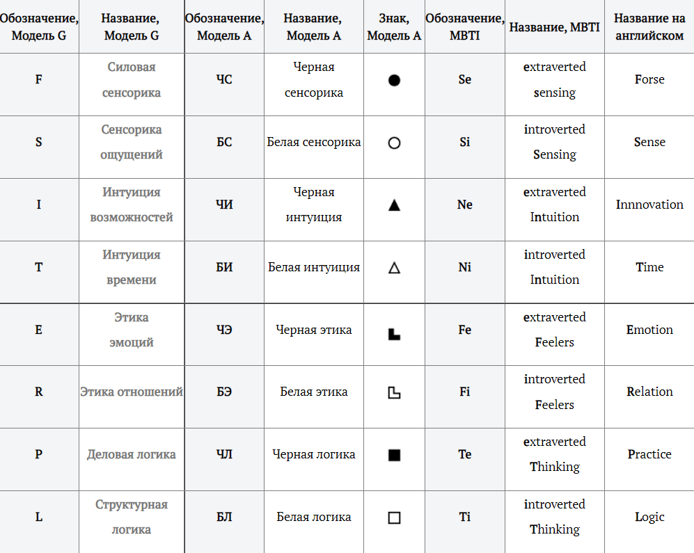

**Функция** - специфическая реакция психики на раздражитель. В каждом типе 8 функций, с их помощью человек воспринимает окружающий мир и реагирует на него.

**Базовая функция (Программная)**  
Это самая сильная сторона социотипа. Через Базовую функцию человек анализирует мир постоянно, наиболее полно и объемно. Рассуждая о разных сферах жизни, он использует больше всего выражений именно по своей Базовой функции.

**Творческая функция (Инструментальная)**  
Вторая по силе. Через неё человек воспринимает и отдаёт в режиме "вкл / выкл», то есть использует её во всю силу, но только по необходимости. Также, как и по Базовой функции, категорий по Творческой функции много в речи и сферах интересов.

**Болевая функция (Мобилизацио́нная)**  
Слабая, не ценностная Это зона игнорирования, наименьшего сопротивления и интереса. По Болевой функции человек болезненно воспринимает информацию и нуждается в тактичной помощи, желательно без лишних слов.

**Ролевая функция (Нормативная)**  
Средняя по силе, не ценностная. Информация по этой функции воспринимается нейтрально. Длительные, подробные рассуждения в этой сфере кажутся не очень интересными. По Ролевой функции проще делать, чем говорить.

**Активационная функция (Референтная)**  
Слабая, но ценностная По ней трудно отдавать самому, но это то, чего хочется получить от других. По Активационной функции человек воспринимает информацию некритично и с благодарностью, нуждается в поддержке и рекомендациях.

**Суггестивная функция (Внушаемая)**  
Слабая, но ценностная. По ней трудно отдавать самому, но это то, чего хочется получить от других. По Суггестивной функции человек воспринимает информацию некритично и с благодарностью, нуждается в поддержке и рекомендациях.

**Ограничительная функция (Наблюдательная)**  
Средняя по силе, не ценностная. Информация по этой функции воспринимается нейтрально. Длительные, подробные рассуждения в этой сфере кажутся не очень интересными. По Ограничительной функции проще делать, чем говорить.

**Фоновая функция (Демонстративная)**  
Сильная, не ценностная. Информация по этой функции воспринимается и понимается легко и полно. Но длительные, подробные рассуждения в этой сфере представляются скучными и бессмысленными. По Фоновой функции проще делать, чем говорить.

---

